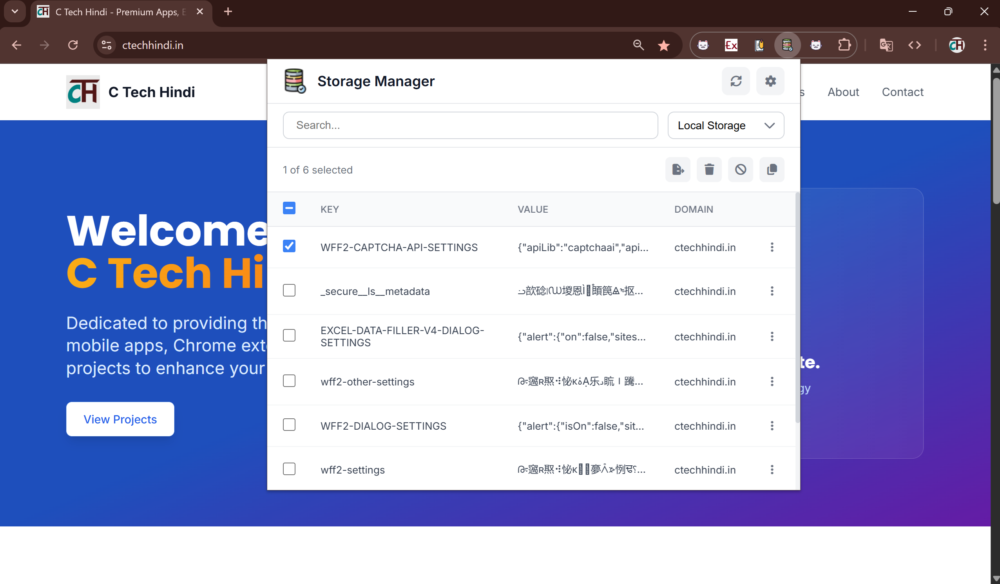

# 🗄️ Storage Manager

A modern and sleek Chrome extension for managing browser storage data including Local Storage, Session Storage, and Cookies.



## ✨ Features

- 🔍 **Local Storage Management**: View, search, and manage Local Storage data
- 📊 **Session Storage Access**: Access and manage Session Storage information
- 🍪 **Cookie Management**: Browse and manage Cookies with detailed information
- 🔎 **Advanced Search**: Search and filter storage data efficiently
- 📤 **Data Export**: Export storage data to JSON format
- 📋 **Clipboard Integration**: Copy storage items to clipboard with one click
- 🗑️ **Data Deletion**: Remove unwanted storage items safely
- 🖥️ **Fullscreen Mode**: Enhanced viewing experience with fullscreen support
- 📄 **JSON Viewer**: Built-in JSON viewer with tree and text modes

## 🚀 Installation

### 🌐 Chrome Web Store

[](https://chromewebstore.google.com/detail/storage-manager/kgcblbnojlegbfkkidmhajjippfbokcb)

### 📥 Manual Installation

1. 📦 Download the extension from [GitHub Releases](https://github.com/jeevan-lal/storage-manager/releases)
2. 📁 Extract the ZIP file
3. 🌐 Open Chrome and go to `chrome://extensions/`
4. ⚙️ Enable "Developer mode"
5. 📂 Click "Load unpacked" and select the extracted folder

## 🛠️ Development

### 📋 Prerequisites

- 🟢 Node.js 18+
- 📦 npm or yarn

### ⚙️ Setup

```bash
# 📥 Clone the repository
git clone https://github.com/jeevan-lal/storage-manager.git
cd storage-manager

# 📦 Install dependencies
npm install

# 🔄 Development mode
npm run watch:chrome

# 🏗️ Build for production
npm run build:chrome

# 🌍 Build for different browsers
npm run build:firefox
npm run build:edge
npm run build:opera
```

### 📜 Build Scripts

- 🔄 `npm run watch:chrome` - Development mode with hot reload
- 🏗️ `npm run build:chrome` - Production build for Chrome
- 🦊 `npm run build:firefox` - Production build for Firefox
- 🌐 `npm run build:edge` - Production build for Edge
- 🎭 `npm run build:opera` - Production build for Opera
- 📦 `npm run zip:chrome` - Build and create ZIP for Chrome Web Store

## 🏗️ Architecture

### 🛠️ Tech Stack

- 🟢 **Frontend**: Vue 3 + TypeScript
- ⚡ **Build Tool**: Vite 7
- 🎨 **Styling**: Tailwind CSS
- 📊 **State Management**: Pinia
- 🎯 **Icons**: Lucide Vue Next
- 📄 **JSON Viewer**: Custom Vue3 JSON Viewer

### 📁 Project Structure

```
storage-manager/
├── src/                    # 📝 Source code
│   ├── components/        # 🧩 Vue components
│   ├── pages/            # 📄 Extension pages
│   ├── store/            # 📊 Pinia stores
│   ├── types/            # 🔧 TypeScript types
│   └── assets/           # 🎨 Static assets
├── src-chrome/           # 🌐 Chrome-specific files
├── src-firefox/          # 🦊 Firefox-specific files
├── src-edge/             # 🌐 Edge-specific files
├── src-opera/            # 🎭 Opera-specific files
├── utils/                # 🛠️ Build utilities
└── dist/                 # 📦 Build output
```

## ⚙️ Configuration

### 🌍 Browser Support

- 🌐 Chrome 88+
- 🦊 Firefox 85+
- 🌐 Edge 88+
- 🎭 Opera 74+

### 📋 Manifest Versions

- 🌐 Chrome/Edge: Manifest V3
- 🦊 Firefox: Manifest V2
- 🎭 Opera: Manifest V3

## 📱 Usage

1. 📥 **Install the extension** from Chrome Web Store
2. 🖱️ **Click the extension icon** in your browser toolbar
3. 🔍 **Select storage type** (Local Storage, Session Storage, or Cookies)
4. 👀 **Browse and manage** your storage data
5. 🔎 **Use search** to find specific items
6. 📤 **Export or copy** data as needed
7. 🗑️ **Delete unwanted** storage items

## 🔒 Privacy & Security

- 🏠 **Local Data Only**: All data processing happens locally in your browser
- 🚫 **No External Servers**: No data is sent to external servers
- 🎯 **Tab-Specific Access**: Only accesses storage from the currently active tab
- 🔓 **Open Source**: Transparent code for security review

## 🤝 Contributing

We welcome contributions! Please feel free to submit issues and pull requests.

### 📝 Development Guidelines

1. 🍴 Fork the repository
2. 🌿 Create a feature branch (`git checkout -b feature/amazing-feature`)
3. 💾 Commit your changes (`git commit -m 'Add amazing feature'`)
4. 📤 Push to the branch (`git push origin feature/amazing-feature`)
5. 🔄 Open a Pull Request

## 📄 License

This project is licensed under the MIT License - see the [LICENSE](LICENSE) file for details.

## 👨‍💻 Author

**Jeevan Lal**

- 🐙 GitHub: [@jeevan-lal](https://github.com/jeevan-lal)
- 📧 Email: [ctechhindi@gmail.com](mailto:ctechhindi@gmail.com)

## 🙏 Acknowledgments

- 🟢 Vue.js team for the amazing framework
- ⚡ Vite team for the fast build tool
- 🎨 Tailwind CSS for the utility-first CSS framework
- 🌐 Chrome Extensions community for guidance and support

## 📊 Statistics

- 📥 **Downloads**: Available on Chrome Web Store
- ⭐ **Stars**: [](https://github.com/jeevan-lal/storage-manager/stargazers)
- 🍴 **Forks**: [](https://github.com/jeevan-lal/storage-manager/network)
- 🐛 **Issues**: [](https://github.com/jeevan-lal/storage-manager/issues)

## 🔗 Links

- 🐙 **GitHub Repository**: [https://github.com/jeevan-lal/storage-manager](https://github.com/jeevan-lal/storage-manager)
- 🌐 **Chrome Web Store**: [https://chromewebstore.google.com/detail/storage-manager/kgcblbnojlegbfkkidmhajjippfbokcb](https://chromewebstore.google.com/detail/storage-manager/kgcblbnojlegbfkkidmhajjippfbokcb)
- 📧 **Support**: [ctechhindi@gmail.com](mailto:ctechhindi@gmail.com)

---

⭐ **Star this repository if you find it helpful!**
